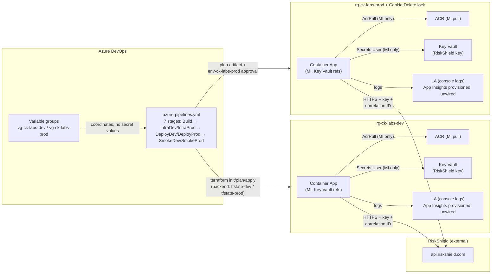

# FinSure Vendor Payment Risk Scoring — Azure Integration Platform

Pollinate standalone assessment.
Integration between FinSure Capital (SME lending) and the RiskShield vendor API,
on Microsoft Azure with Terraform and Azure DevOps.

Status: **Phases 0–8 complete**: .NET 10 API green, Dockerfile, bootstrap
state storage, four Terraform child modules, root module with dev/prod
environments, seven-stage Azure DevOps pipeline (Build, InfraDev, InfraProd,
DeployDev, DeployProd, SmokeDev, SmokeProd), this doc set, and local E2E
evidence (`docs/e2e-evidence.md`).

## Layout

```text
Pollinate/
├── README.md            # this file: architecture, run/deploy, threat model
├── scripts/
│   ├── Run-Local-Dotnet.ps1  # dotnet run + health/validate checks (param-driven)
│   └── Run-Local-Docker.ps1  # build/run/whoami/health/validate/PII checks + cleanup
├── docs/
│   └── e2e-evidence.md  # Phase 8 local E2E evidence (health 200, validate 502)
├── app/                # .NET 10 minimal API + xUnit tests
│   ├── FinSure.RiskScoring.slnx
│   ├── Directory.Packages.props   # central NuGet versions
│   ├── NuGet.config               # nuget.org source mapping
│   ├── Dockerfile                 # SDK build → alpine runtime, non-root, healthcheck
│   ├── src/FinSure.RiskScoring.Api/
│   └── tests/FinSure.RiskScoring.Api.Tests/
├── terraform/          # bootstrap, root module, child modules, env tfvars
│   ├── bootstrap/      # run-once remote-state storage (local backend)
│   ├── modules/ck-labs_az_container_app/
│   ├── modules/ck-labs_az_container_registry/
│   ├── modules/ck-labs_az_key_vault/
│   ├── modules/ck-labs_az_observability/
│   └── environments/{dev,prod}.tfvars
└── pipelines/azure-pipelines.yml  # 7 stages: Build → InfraDev → InfraProd → DeployDev → DeployProd → SmokeDev → SmokeProd
```

## Architecture



Request path: caller → Container App ingress (HTTPS-only, external) →
`POST /validate` → app reads the RiskShield key from its Key Vault secret
reference (resolved inside Azure, never in Terraform or pipeline logs) →
HTTPS call to RiskShield with `X-Correlation-ID` → scored response or a
mapped 502/504. Health: `/health/live` (self) and `/health/ready` (vendor key
resolved). Resilience is `AddStandardResilienceHandler` (timeout + retry +
circuit breaker); retries cover 5xx/408/429 only. Vendor 4xx is never retried.
Per-attempt timeout 5s, up to 3 retries, total budget 25s
(`5s × (3+2)`), inside the Container Apps ingress ~30s front-end default
(azurerm 4.81 has no ingress timeout knob, so the app budget must stay under
it; otherwise the platform 504s before the app maps its own 504).

Observability: console logs only, forwarded to Log Analytics by the Container
Apps environment. Console shipping covers the current scope by design.
Application Insights is provisioned but unwired: no
connection string is passed (`env_vars` carries no telemetry setting, the root
module exposes no Insights output), the API has no exporter, and the
`FinSure.RiskScoring` meter is in-process only. Trade-off: console logs keep the path simple with no SDK; Insights adds distributed tracing at the cost of SDK wiring and secret handling. One-var wiring path when needed: store the Insights connection string as a vault secret, map it via `secret_env` (APPLICATIONINSIGHTS_CONNECTION_STRING), add the SDK/exporter, no other infra reshaping.

Terraform shape: one resource group per environment plus four child modules
(depth ≤ 2, no child-to-child references). `observability` first, then
`registry` and `vault` ids into `container_app`; `container_app` carries
`depends_on = [module.observability]` and an internal 60s `time_sleep`
RBAC-propagation guard so the first image pull / secret resolve never races
AAD role-assignment propagation.

## API

- `POST /validate` `{firstName, lastName, idNumber}` → `{riskScore, riskLevel}`
  - 400 malformed input, 502 vendor 5xx/4xx/transport, 504 vendor timeout.
- `GET /health/live` (self) and `GET /health/ready` (vendor key resolved).
- Correlation: inbound `X-Correlation-ID` accepted or minted, capped at 128 chars
  with `[A-Za-z0-9-]` allowlist (overlong truncates, invalid mints), echoed on the
  response, forwarded to RiskShield.
- Resilience: `AddStandardResilienceHandler` (timeout + retry + circuit breaker);
  retries 5xx/408/429 only. Vendor 4xx is never retried.
- PII: `idNumber` is never logged. Logs carry score metadata and id length only.
  Covered by an explicit test (`IdNumber_NeverReachesLogs`).
- One built-in meter: `FinSure.RiskScoring` / `riskscoring.validations{outcome}`
  (in-process only, no exporter; console logs are the shipped telemetry).

## Run locally

F5 / `dotnet run` needs `RiskShield__ApiKey` (`Required` + `ValidateOnStart`,
otherwise `OptionsValidationException` on start). `Properties/launchSettings.json`
ships a `local-dummy-key` placeholder for F5; the CLI equivalent is below
(real key lives in Key Vault, never in code). Scripted form (each script
prints every command before running it):

```powershell
pwsh ./scripts/Run-Local-Dotnet.ps1   # dotnet run on http://127.0.0.1:18080 + health/validate checks
pwsh ./scripts/Run-Local-Docker.ps1   # build finsure-risk-scoring:local + run + whoami/health/validate/PII checks + cleanup
```

Manual equivalents (the same steps the scripts run):

```powershell
cd Pollinate/app
$env:RiskShield__ApiKey = 'local-dummy-key'   # vendor key; real key lives in Key Vault
dotnet run --project src/FinSure.RiskScoring.Api --urls http://127.0.0.1:18080

# health
Invoke-RestMethod http://127.0.0.1:18080/health/live    # 200
Invoke-RestMethod http://127.0.0.1:18080/health/ready   # 200

# validate (502 expected: api.riskshield.com is unreachable; wiring is correct)
Invoke-WebRequest http://127.0.0.1:18080/validate -Method Post `
  -Body '{"firstName":"Jane","lastName":"Doe","idNumber":"9001011234088"}' `
  -ContentType 'application/json' -SkipHttpErrorCheck
```

Or via Docker (build context is `app/`):

```powershell
cd Pollinate/app
docker build -f Dockerfile -t finsure-risk-scoring:local .
docker run --rm -p 18080:8080 -e RiskShield__ApiKey=local-dummy-key finsure-risk-scoring:local
docker exec <cid> whoami   # app (non-root, UID 1654)
Invoke-RestMethod http://127.0.0.1:18080/health/live    # 200
Invoke-WebRequest http://127.0.0.1:18080/validate -Method Post `
  -Body '{"firstName":"Jane","lastName":"Doe","idNumber":"9001011234088"}' `
  -ContentType 'application/json' -SkipHttpErrorCheck   # 502 expected
docker logs <cid> | Select-String '9001011234088'       # 0 matches: idNumber never logged
docker rm -f <cid>
```

## Validate

```powershell
cd Pollinate/app
dotnet test FinSure.RiskScoring.slnx --configuration Release            # 23/23 passed
dotnet test FinSure.RiskScoring.slnx --configuration Release --collect:'XPlat Code Coverage'  # >=80% line gate (line-rate reported by coverage.cobertura.xml)
dotnet list tests/.../FinSure.RiskScoring.Api.Tests.csproj package --vulnerable
dotnet publish src/FinSure.RiskScoring.Api -c Release
```

```powershell
cd Pollinate/terraform
terraform fmt -check -recursive
terraform init -backend=false; terraform validate   # root
cd bootstrap; terraform fmt -check; terraform validate
python -c "import yaml; yaml.safe_load(open('../pipelines/azure-pipelines.yml'))"  # YAML re-parse
```

## Deploy

### 1. Bootstrap once per subscription

```powershell
cd Pollinate/terraform/bootstrap
terraform init; terraform fmt -check; terraform validate
terraform plan -out bootstrap.tfplan
terraform apply bootstrap.tfplan
terraform output resource_group_name     # -> tfStateResourceGroup
terraform output storage_account_name    # -> tfStateStorageAccount
```

### 2. Bootstrap output → variable group wiring

Create `vg-ck-labs-dev` / `vg-ck-labs-prod` (Key Vault–linked for secrets).
Secret *values* never live here: only names and non-secret coordinates.

| Source (terraform output) | Variable group variable | Used by |
|---|---|---|
| `bootstrap: resource_group_name` | `tfStateResourceGroup` | `terraform init -backend-config` (both envs) |
| `bootstrap: storage_account_name` | `tfStateStorageAccount` | `terraform init -backend-config` (both envs) |
| `root: resource_group_name` (`rg-ck-labs-<env>`) | `appResourceGroup` | Deploy verify `az containerapp show -g` |
| `root: app_fqdn` | `appFqdn` | Smoke `https://$(appFqdn)/health/*` |
| `root: app_name` | `containerAppName` | Deploy verify `--name` |
| `root: registry_login_server` (host part) | `acrName` | Build `az acr login --name`, image prefix |
| `root: vault_uri` (vault name part) | `keyVaultName` | Secret triage (`az keyvault secret show`) |
| Key Vault secret `riskshield-api-key` (value, never committed) | `riskShieldApiKey` (secret, via Key Vault–linked group) | Infra plan `-var="secrets={...}"` → vault secret + Container App ref |

First deploy (RiskShield key wiring): without this, the app crash-loops on
`OptionsValidationException` (`RiskShield__ApiKey` is `Required` +
`ValidateOnStart`) and the Container App gets no `secret` block.

1. Put the real vendor key in Key Vault and expose it to the pipeline as
   `riskShieldApiKey` through the Key Vault–linked `vg-ck-labs-dev` /
   `vg-ck-labs-prod` groups (per-env values; the pipeline only ever
   references the `$(riskShieldApiKey)` name).
2. The Infra plan steps forward it without touching tfvars:
   `-var="secrets={ \"riskshield-api-key\" = \"$RISKSHIELD_API_KEY\" }"`
   (mapped from `$(riskShieldApiKey)` via the step `env:` block, so the
   value never appears in YAML or tfvars and stays `sensitive` in state).
3. `environments/{dev,prod}.tfvars` carry only the name mapping
   `secret_env = { "RiskShield__ApiKey" = "riskshield-api-key" }`. The root
   module forwards `module.vault.secret_ids` into `container_app`
   `key_vault_secrets`, which renders the `secret` block and the
   `RiskShield__ApiKey` env ref. Never put the key value in tfvars
   (plan renders it `(sensitive value)`; rotate in Key Vault on any leak).

Also required outside this file: service connections `sc-ck-labs-dev` /
`sc-ck-labs-prod`, and an Environment approval on `env-ck-labs-prod` (see below).

### 3. Queue-time imageTag override

`imageTag` defaults to `$(Build.BuildId)`. The Build stage pushes
`$ACR/$(imageName):$(imageTag)`; Infra passes
`-var="image={ name = \"$(imageName)\", tag = \"$(imageTag)\" }"`; Deploy
verifies the running image host is `$(acrName).azurecr.io` with tag
`$(imageTag)` and fails otherwise.
To redeploy or roll back without a new commit, queue the pipeline with
`imageTag` overridden to an existing ACR tag. Infra applies that tag and
Deploy verifies it. Never `az containerapp update` the image outside
Terraform: it mutates TF-owned fields (cpu/memory/scale/secrets) and causes
drift on the next plan.

### 4. Prod approval flow (`env-ck-labs-prod`)

`InfraProd` plans first (`TerraformPlanProd` job, plan published as the
`tfplan-prod` artifact), then the `TerraformApplyProd` **deployment** job
targets the `env-ck-labs-prod` environment. The environment's approval check
holds the run until a reviewer approves; only then does the job download the
exact published plan artifact and `terraform apply` it. Dev has no gate
(`InfraDev` plans and applies in one job). Smoke runs per env after Deploy.

### 5. Smoke-failure triage

Smoke contract: `/health/*` must be 2xx; `/validate` passes on **200 or 502**
(502 = vendor unreachable, wiring correct: the expected state without a real
vendor key). Anything else fails the stage.

| Symptom | Likely cause | Check |
|---|---|---|
| `/health/live` non-2xx / connection refused | App down or wrong `appFqdn` | `terraform output app_fqdn`; Container App revision status |
| `/health/ready` 503 | Vendor key secret ref broken | `keyVaultName` var; `az keyvault secret show`; Secrets User assignment (allow ~60s RBAC propagation) |
| `/validate` 400 | Bad payload (contract is `firstName/lastName/idNumber`) | Resend synthetic payload from this README, not ad-hoc fields |
| `/validate` 502 | Vendor unreachable / bad key | Expected without a live vendor; check key + vendor status otherwise |
| `/validate` 504 | Vendor slow | Resilience timeouts; vendor latency dashboards |
| Deploy verify host/tag mismatch | `imageTag` override not propagated, or wrong `acrName` | Queue-time variable vs ACR tags; re-run Infra, not `az containerapp update` |
| Terraform auth failure | Service connection / expired secret | `sc-ck-labs-<env>` health; backend vars `tfStateResourceGroup`/`tfStateStorageAccount` |

All smoke payloads are synthetic (`Test User / 9001011234088`). Never use real
IDs, emails, or vendor keys in smoke tests.

## Locks and network notes

- `lock_type = ""` in dev (no lock, fast iteration); `"CanNotDelete"` in prod
  on `rg-ck-labs-prod`. The lock also blocks `terraform destroy` of the RG
  contents. Prod teardown is a deliberate two-step (remove lock, then destroy).
- No IP allow-list knob exists (no child module takes one, nothing in
  tfvars). Future wiring (e.g. vault network ACLs) only needs a module
  input. No root reshaping.

## Threat model (STRIDE-lite)

| # | Threat | Mitigation in this repo |
|---|---|---|
| T0 | Anonymous `/validate`, no auth / rate limit (**highest severity**) | **No mitigation in this repo.** Ingress is internet-external and `POST /validate` takes no caller credential (no API key/JWT) and has no throttling. Anyone can burn RiskShield quota or enumerate PII. Do not expose beyond test traffic without an APIM/WAF/rate-limit front door |
| T1 | PII (`idNumber`) leaks into logs/traces; PII egressed to RiskShield | Local logs: never logged; only score metadata + id length (`ValidateEndpoint.cs:60-63`); explicit regression test `IdNumber_NeverReachesLogs`; synthetic payloads only in smoke. Egress: full `firstName/lastName/idNumber` is POSTed to RiskShield `v1/score` by design. No DPA / retention / residency basis is documented here (compliance review is out of scope) |
| T2 | RiskShield key stolen from code/state/CI | Key lives in Key Vault; app resolves it via secret reference inside Azure; Terraform passes only secret *ids* (`sensitive = true`, never values); pipeline passes the value once via `-var="secrets={...}"` from the `$(riskShieldApiKey)` secret (Key Vault–linked group); tfvars carry only the `secret_env` name mapping; never committed (covered by the repo secret-scan gate) |
| T3 | Image tampering / public pull | Private ACR; **MI-only** pull (`AcrPull` on the app's user-assigned identity, admin account off); image pinned by `imageTag` and checked at Deploy |
| T4 | Privilege use before RBAC propagates | 60s `time_sleep.rbac_propagation` guard inside the Container App module; Deploy verify fails loudly on mismatch instead of silently drifting |
| T5 | Plaintext / downgraded traffic | Ingress HTTPS is the Container Apps **provider default** (`external_enabled = true`), not an explicit TLS/min-version setting; container transport is plain HTTP on 8080 inside the managed environment only. Vendor TLS is **enforced at startup**: `RiskShieldOptions.BaseUrl` requires absolute `https://` scheme (`RiskShieldOptions` validation + `ValidateOnStart` fails start on `http://`), default stays `https://api.riskshield.com`; regression test covers `http://` rejection |
| T6 | Spoofed requests / untraceable calls | `X-Correlation-ID` accepted-or-minted, echoed and forwarded to RiskShield; health split (`live` vs `ready`) so infra vs vendor-config failures are distinguishable. Echo is capped (see T10) |
| T7 | Prod mutated without review | `env-ck-labs-prod` manual approval on the exact published `tfplan-prod` artifact; `CanNotDelete` lock on the prod RG |
| T8 | State-file tampering / cross-env bleed | Per-env state (`tfstate-dev` / `tfstate-prod` containers + keys) in a TLS 1.2, no-public-blob storage account; bootstrap root is local-state and never destroyed while envs exist |
| T9 | Public network defaults, no allow-list knob | ACR `public_network_access_enabled` defaults `true`, vault `public_network_access_enabled` defaults `true`, state storage has no network lockdown and no tags (see `terraform/bootstrap/README.md`); no child module takes an allow-list input. No mitigation yet. Add module inputs for vault/registry network ACLs + private endpoints before handling real PII |
| T10 | Log injection / header bloat via correlation ID | `CorrelationIdMiddleware` caps inbound `X-Correlation-ID` at 128 chars with `[A-Za-z0-9-]` allowlist into the response header, the log scope, and the vendor header. Overlong valid values truncate to 128; values with invalid chars mint a new id. Bounds header/log size and blocks log injection and cache-key poisoning. Covered by overlong/invalid tests |

Out of scope / residual risk: T0 open to the internet (needs auth + rate limiting);
no WAF or private-endpoint hardening yet; PII
egress to RiskShield has no documented compliance basis (T1);
vendor availability is external (502/504 mapped, not prevented); secret rotation
is manual via Key Vault.

## Assumptions (decision log)

| # | Assumption |
|---|---|
| A1 | Deliverable lives at `Pollinate/` in the existing repo, not a new repo. |
| A2 | .NET 10 minimal API (least custom code: resilience, health, DI in framework). |
| A3 | Azure Container App (first-listed option; MI + Key Vault refs + LA wiring). |
| A4 | Terraform `>= 1.3.6`; CI pins `1.9.8` (`tfVersion` in the pipeline); azurerm `=4.81.0` (avoids 5.x breaking changes). Full pin matrix lives in `terraform/README.md`. |
| A5 | Environments exactly `dev` and `prod`. |
| A6 | No real RiskShield key: happy path proven via stubbed client; live returns clean 502. |
| A7 | xUnit **v2.9.3** (template default), not v3. KISS: v3 runner migration buys nothing here. |
| A8 | `.slnx` solution format (dotnet 10 SDK default). |
| A9 | No blueprints, no generator, no `run.ps1`, no submodules: hand-written IaC only. |
| A10 | `app/Dockerfile` build context is `app/`; runtime `aspnet:10.0-alpine` (lean + busybox `wget` HEALTHCHECK), non-root `app` user, `EXPOSE 8080`. |
| A11 | Bootstrap uses one LRS storage account + per-env containers (dev/prod isolated by container + backend key); `southafricanorth` default region; storage suffix via `storage_suffix` var. |
| A12 | Smoke `/validate` passes on 200 (vendor live) or 502 (vendor unreachable, wiring correct); synthetic payloads only. |
| A13 | Pipeline SDK is .NET 10 (`10.0.x`) to match the `net10.0` target; deploy goes through Terraform (image-tag var), never `az containerapp update`. |
| A14 | Vendor `BaseUrl` https enforcement is code (`RiskShieldOptions` validation + `ValidateOnStart`), not a config promise; correlation cap is code (128 + allowlist). App Insights stays unwired console-shipped by design with a documented one-var wiring path. |

## Roadmap

- Phase 2: ~~multi-stage Dockerfile~~ done (`app/Dockerfile` + `app/.dockerignore`).
- Phase 3: ~~`terraform/bootstrap/` remote-state backend~~ done.
- Phase 4: ~~child modules~~ done (`ck-labs_az_container_app`, `ck-labs_az_container_registry`, `ck-labs_az_key_vault`, `ck-labs_az_observability`).
- Phase 5: ~~root module + `environments/{dev,prod}.tfvars`~~ done.
- Phase 6: ~~`pipelines/azure-pipelines.yml`~~ done (7 stages: Build → InfraDev → InfraProd → DeployDev → DeployProd → SmokeDev → SmokeProd; prod approval via `env-ck-labs-prod`).
- Phase 7: ~~full README + threat model + wiring docs~~ done (this file + `terraform/README.md`).
- Phase 8: ~~E2E evidence~~ done (`docs/e2e-evidence.md`).
